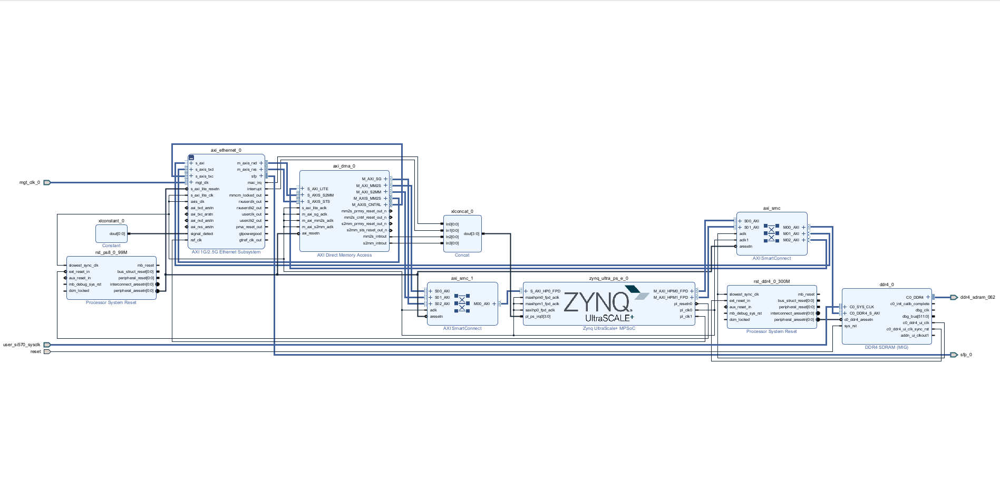

# Zynq UltraScale+ Gigabit Ethernet Platform


A Vivado 2023.2 block design implementing a Gigabit Ethernet data path using the AMD/Xilinx AXI Ethernet Subsystem, AXI DMA, DDR4 Memory Interface Generator (MIG), and Zynq UltraScale+ MPSoC.

The design was recreated from a TCL-based reference architecture and successfully validates in Vivado 2023.2.
--
## Architecture Overview

The platform combines:

* Zynq UltraScale+ MPSoC (PS)
* DDR4 Memory Interface Generator (MIG)
* AXI 1G/2.5G Ethernet Subsystem
* AXI DMA (Scatter-Gather Enabled)
* AXI SmartConnect
* Interrupt Aggregation (xlconcat)
* SFP-Based 1000BASE-X Ethernet Interface
---
### Data Path

<p align="center">
  
</p>

---
## Features

* 1000BASE-X Ethernet over SFP
* AXI DMA Scatter-Gather Mode
* Full TX/RX Checksum Offload
* External DDR4 Memory Access
* HP0 DMA Data Path
* AXI-Lite Software Control Interface
* Interrupt Aggregation to PS
* 156.25 MHz GT Reference Clock Support
---
## IP Blocks

| IP              | Function                        |
| --------------- | ------------------------------- |
| zynq_ultra_ps_e | Processing System               |
| ddr4            | DDR4 Memory Interface Generator |
| axi_ethernet    | AXI Ethernet Subsystem          |
| axi_dma         | Scatter-Gather DMA Engine       |
| axi_smc         | AXI SmartConnect                |
| xlconcat        | Interrupt Aggregation           |
| xlconstant      | Constant Logic                  |
| proc_sys_reset  | Reset Generation                |

---

## Ethernet Configuration

* Ethernet Speed: 1 Gbps
* PHY Type: 1000BASE-X
* TX Memory: 32 KB
* RX Memory: 32 KB
* TX Checksum Offload: Full
* RX Checksum Offload: Full
* Frame Filter: Disabled
* IEEE 1588 Timestamping: Disabled
---
## DMA Configuration

* Scatter-Gather Enabled
* 64-bit Address Width
* 64-bit Memory-Mapped Interface
* 32-bit AXI Stream Interface
* DRE Enabled (Unaligned Transfers Supported)
* Buffer Length Width: 16
* RxLength Status Support Enabled
---
## Reproducing the Design

### Prerequisites

* AMD/Xilinx Vivado 2023.2
* Target board supported by the design
* Access to required AMD/Xilinx IP repositories
* Valid AXI Ethernet IP license (required for bitstream generation)

### Option 1: Open the Block Design

1. Clone this repository:

   ```bash
   git clone https://github.com/<username>/zynqmp-1g-ethernet-dma-ddr4-design.git
   ```

2. Launch Vivado 2023.2.

3. Create a new RTL project for the target board.

4. Add `design_1.bd` to the project.

5. Open the Block Design in IP Integrator.

6. Validate the design:

   ```text
   Tools → Validate Design
   ```

7. Open the Address Editor and ensure all addresses are assigned.

---

### Option 2: Recreate the Design Using TCL

1. Create a new Vivado 2023.2 project.

2. Open the Tcl Console.

3. Source the exported block design script:

   ```tcl
   source design_1.tcl
   ```

4. Vivado will recreate the block design automatically.

5. Validate the design:

   ```text
   Tools → Validate Design
   ```

---

### Generating a Bitstream

After the design has been recreated:

1. Generate Output Products.
2. Create HDL Wrapper.
3. Run Synthesis.
4. Run Implementation.
5. Generate Bitstream.

> Note: Bitstream generation requires a valid AMD/Xilinx AXI Ethernet IP license.

---
## Vivado Version

Validated using:

* Vivado 2023.2
---
## Block Diagram

<p align="center">
  
</p>

---
## Build Information

| Item | Status |
|--------|--------|
| Block Design Creation | ✅ |
| Address Assignment | ✅ |
| Design Validation | ✅ |
| Output Products | ✅ |
| HDL Wrapper | ✅ |
| Bitstream Generation | ⚠️ Requires AXI Ethernet IP License |

---

## Notes

The block design validates successfully in Vivado 2023.2.

Bitstream generation requires a valid AMD/Xilinx license for the AXI Ethernet IP core.

This repository is intended for educational, research, and reference purposes.
