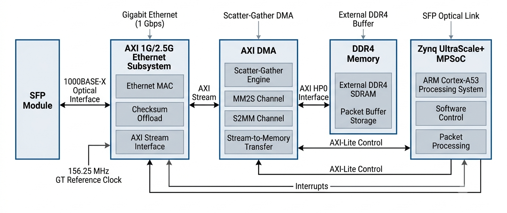

# Zynq UltraScale+ Gigabit Ethernet Platform

A Vivado 2023.2 block design implementing a Gigabit Ethernet data path using the AMD/Xilinx AXI Ethernet Subsystem, AXI DMA, DDR4 Memory Interface Generator (MIG), and Zynq UltraScale+ MPSoC.

The design was recreated from a TCL-based reference architecture and successfully validates in Vivado 2023.2.

## Architecture Overview

The platform combines:

* Zynq UltraScale+ MPSoC (PS)
* DDR4 Memory Interface Generator (MIG)
* AXI 1G/2.5G Ethernet Subsystem
* AXI DMA (Scatter-Gather Enabled)
* AXI SmartConnect
* Interrupt Aggregation (xlconcat)
* SFP-Based 1000BASE-X Ethernet Interface

### Data Path

  

## Features

* 1000BASE-X Ethernet over SFP
* AXI DMA Scatter-Gather Mode
* Full TX/RX Checksum Offload
* External DDR4 Memory Access
* HP0 DMA Data Path
* AXI-Lite Software Control Interface
* Interrupt Aggregation to PS
* 156.25 MHz GT Reference Clock Support

## IP Blocks

| IP              | Function                        |
| --------------- | ------------------------------- |
| zynq_ultra_ps_e | Processing System               |
| ddr4            | DDR4 Memory Interface Generator |
| axi_ethernet    | AXI Ethernet Subsystem          |
| axi_dma         | Scatter-Gather DMA Engine       |
| axi_smc         | AXI SmartConnect                |
| xlconcat        | Interrupt Aggregation           |
| xlconstant      | Constant Logic                  |
| proc_sys_reset  | Reset Generation                |

## Ethernet Configuration

* Ethernet Speed: 1 Gbps
* PHY Type: 1000BASE-X
* TX Memory: 32 KB
* RX Memory: 32 KB
* TX Checksum Offload: Full
* RX Checksum Offload: Full
* Frame Filter: Disabled
* IEEE 1588 Timestamping: Disabled

## DMA Configuration

* Scatter-Gather Enabled
* 64-bit Address Width
* 64-bit Memory-Mapped Interface
* 32-bit AXI Stream Interface
* DRE Enabled (Unaligned Transfers Supported)
* Buffer Length Width: 16
* RxLength Status Support Enabled

## Vivado Version

Validated using:

* Vivado 2023.2

## Block Diagram

Insert block diagram screenshot here.

## Notes

The block design validates successfully in Vivado 2023.2.

Bitstream generation requires a valid AMD/Xilinx license for the AXI Ethernet IP core.

This repository is intended for educational, research, and reference purposes.
